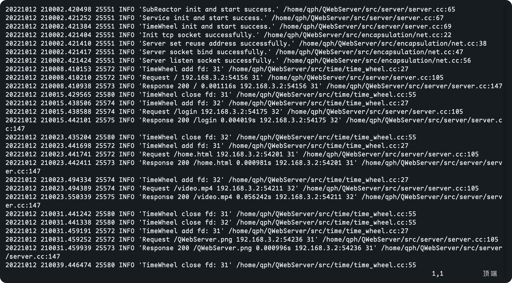

<h1 align="center"> QWebServer </h1>


## 概述

`QWebServer` 是一款使用现代C++编写的高性能Web服务器，能够负荷上万的并发量。

为了保持大部分的源码为现代C++风格，手动封装了一些Linux C的函数。

## 项目亮点

- Multi-Reactor模型()

- 半同步/半异步堆模型

- 高可用的线程池和对象池

- 高效的双缓冲异步日志

- 对象池管理MySql连接

- 使用RAII从对象池获取MySql连接

- 时间轮处理非活跃连接

- 使用正则表达式解析HTTP请求

## 开发环境

开发此项目时使用的环境(VM-Ware):

- CPU: 12th Gen Intel i7-12700H (4) @ 2.688GHz

- OS: Ubuntu 22.04.1 LTS x86_64

- Memory: 4 GB

## 开发依赖

在开始使用此项目前，请确定以下的依赖均已齐全:

- CMake

- g++ 11 (至少支持 C++20)

- MySql 5.7 / 8.0

- lib: openssl, mysql++, jsoncpp(已包含)

>  在编译此项目之前，应保证已经配置好以上的依赖库

你可以使用以下命令去安装 `MySql` 和 `libmysql++` 在 Ubuntu 22.04 中:

```shell
$ sudo apt-get install mysql-client mysql-server libmysql++-dev 
```

本项目用的MySql建表语句如下:

```mysql
CREATE TABLE `user` (
    `id` INT unsigned  NOT NULL AUTO_INCREMENT,
    `name` VARCHAR(64) NOT NULL,
    `salt` CHAR(6) NOT NULL,
    `sha256` CHAR(64) NOT NULL,
    PRIMARY KEY (`id`),
    UNIQUE KEY `key_name` (`name`)
) ENGINE=InnoDB DEFAULT CHARSET=utf8mb4 COLLATE=utf8mb4_unicode_ci;
```

> 在运行此项目前应该保证在运行项目的主机上能够连接到使用的MySql服务器

## 快速开始

1. 使用默认的配置或在 `config.json`中写入你的配置。有关配置文件  `config.json` 的详细详细说明可见 [config-zh.md](docs/config-zh.md).

2. 在Shell中输入如下命令:

```shell
$ chmod 744 install.sh
$ sudo ./install.sh $USER
```

> 在确保了解整个项目的配置和运行流程后，可以自行修改install.sh

3. 用 `CMake`构建项目

```shell
$ cmake --build ./build/Debug --target QWebServer -- -j 6
```

4. 运行这个项目并且进行测试

在Linux服务器上运行如下命令

```shell
# 在项目的路径中
$ cd ./build/Debug
# 如果进行临时测试 
$ ./QWebServer
# 如果想要长时间运行此项目
# 因为项目中有自己的异步日志记录，所以标准输出只会输出错误信息
$ nohup ./QWebServer > error.log &
```

> 确保本地是可以与所运行的Linux服务器是能够Ping通的

在浏览器中输入 `${Linux Server IP}:${port}` 

如果所有事情都顺利的话，你会看到一个HTML页面，可见 **运行截图**部分

## 运行截图

- Index/Login Page


- Home Page


- Change Password Page


- AsyncLog



## 压力测试


> 使用[WebBench1.5](https://github.com/EZLippi/WebBench)进行测试

## 相关文档

