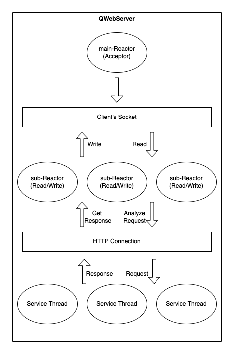
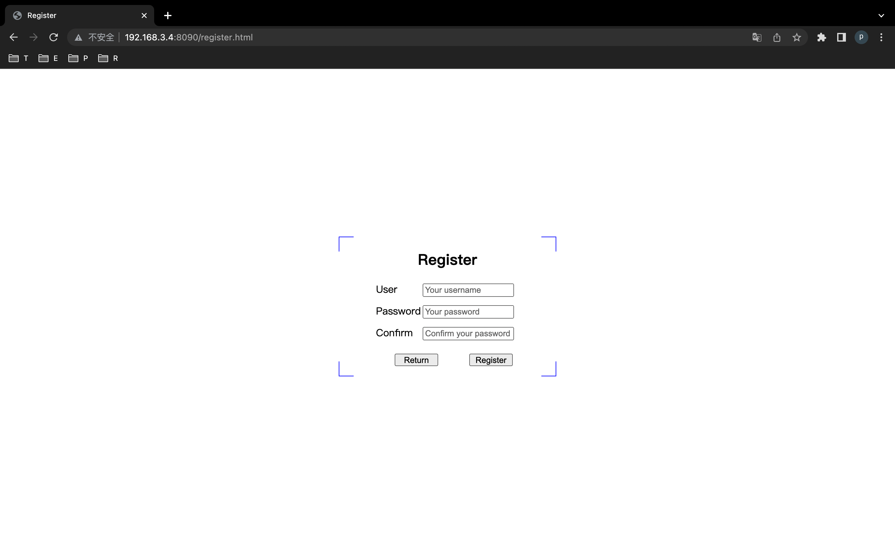
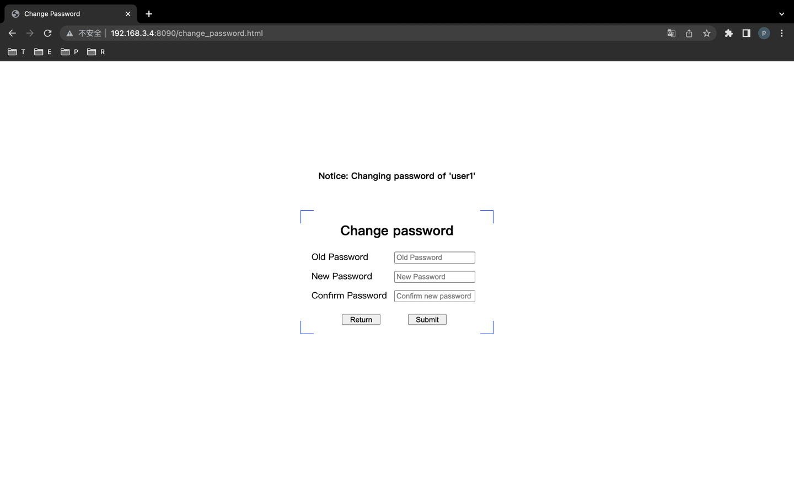

<h1 align="center"> QWebServer </h1>


> 如果你需要一份中文版本的README，请见: [README-zh](README-zh.md)

## OverView

`QWebServer` is a Linux high performance WebServer written in modern C++. It can handle tens of thousands of concurrent HTTP Request.

In order to keep most of the source code in modern C++ style, some Linux C functions are manually encapsulated.

The `QWebServer` use Multi-Reactor and Thread Pool deal with the connection. Here is the main overall architecture.



## Feature

- Multi-Reactor Model

- Half Synchronous / Half Asynchronous Heap Model

- Highly reusable Thread Pool and Object Pool

- Highly efficient Double Buffer Asynchronous Log System

- Object Pool manage MySqlConnections

- Use RAII get MySqlConnection from Object Pool

- Timer Wheel deal with inactive connection

- Use Regex analyze HTTP Request 

## Development Environment

Here is the list of the environment of this project(VM-Ware):

- CPU: 12th Gen Intel i7-12700H (4) @ 2.688GHz

- OS: Ubuntu 22.04.1 LTS x86_64

- Memory: 4 GB

## Dependencies

Before you run this project, please make sure:

- CMake

- g++ 11 (at least support C++20)

- MySql 5.7 / 8.0

- lib: openssl, mysql++, jsoncpp(included)

> Before you compile and run this project, please make sure have installed these libs.

You can use this command to install `MySql` and `libmysql++` in Ubuntu 22.04:

```shell
$ sudo apt-get install mysql-client mysql-server libmysql++-dev 
```

You can use this command to install `openssl`

```shell
$ sudo apt install openssl
```

The create table's SQL in mysql is:

```mysql
CREATE TABLE `user` (
    `id` INT unsigned  NOT NULL AUTO_INCREMENT,
    `name` VARCHAR(64) NOT NULL,
    `salt` CHAR(5) NOT NULL,
    `sha256` CHAR(64) NOT NULL,
    PRIMARY KEY (`id`),
    UNIQUE KEY `key_name` (`name`)
) ENGINE=InnoDB DEFAULT CHARSET=utf8mb4 COLLATE=utf8mb4_unicode_ci;
```

> tips: Make sure you can connect to MySql Server in the host where this project run.

## Quick Start

1. Use the default config or customize your config in `config.json`. The detailed description of the `config.json` can be found in [config.md](docs/config.md).

2. Run the commands in shell as follows:

```shell
$ chmod 744 install.sh
$ sudo ./install.sh $USER
```

> tips: You can change the content of the install.sh, but you must fully understand how the config work of this project before you do that.

3. Build the project with `CMake`

```shell
# 1. Create a build directory
$ mkdir build
# 2. Step into build directory
$ cd build
# 3. Generate debug version makefile
$ cmake .. -DCMAKE_BUILD_TYPE=Debug
# 3. Generate release version makefile
$ cmake .. -DCMAKE_BUILD_TYPE=Release
# 4. Use make to build this project
$ make
```

4. Run this project and test

Run the project in your Linux Server

```shell
# In the project path
$ cd ./build/Debug
# If you just want to do some tests 
$ ./QWebServer
# If you want to run it for long time
# Because this project have own AsyncLog, the stdout will only output some error log.
$ nohup ./QWebServer > error.log &
```

> tips: Make sure you can ping the Linux Server

Type in `${Linux Server IP}:${port}` on your browser.

If every thing is OK, you will see the HTML like the images in the **Screenshot**.

## Screenshot

- Index/Login Page


- Register Page



- Home Page


- Change Password Page



- AsynchronousLog


## Bench

- 10000 Concurrent Clients, 30228 QPS


> Bench test uses [WebBench1.5](https://github.com/EZLippi/WebBench)

## Documents

- [Config](docs/config.md)

- [Asynchronous Log System](docs/asynclog.md)

- [Object Pool](docs/object-pool.md)

- [Thread Pool](docs/thread-pool.md)

- [Timer](docs/timer.md)

## TODO

This project has some places can be optimized, these places I have use `TODO` annotation to mark them.

Specifically, the TODO things in the files:

- `src/pool/object_pool.hpp`(2 TODO)

- `src/log/buffer.h`(1 TODO)

- `src/encapsulation/epoll_listener.h`(1 TODO)

- `src/time/timer.h`(1 TODO)

## Thanks

@YouShuang - the author of the "Linux 高性能服务器编程"

@[ChenShuo](https://github.com/chenshuo) - the author of the net library `muduo`

## Other

This project is for learning and communication only.

I don't need you to buy me a cup of coffee or any sponsorship. If you want to support this project, you just need to star this project.

Welcome Issue and PR.