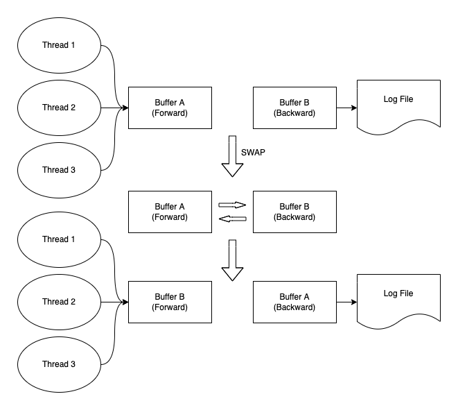

# 异步日志

## 概述

异步日志系统实现了如下功能:

- 精确到微妙

- 记录了线程ID

- 记录了日志的级别

- 记录了源文件及代码行号

- 线程安全

## 异步日志与同步日志的区别

- 同步日志工作流程: 构造日志消息->获取锁->写入文件
- 异步日志工作流程: 构造日志消息->获取锁->写入缓冲区

异步日志和同步日志的区别就在于，异步日志写入缓冲区后，由别的进程或线程将缓冲区的内容写入文件。显而易见，文件I/O操作比程序内的操作慢的多，当并发量较高，日志较多的情况下，若使用同步日志，会使其阻塞在获取锁的步骤，导致效率变慢。而异步日志的好处就在于，对于日志系统以外的程序而言，并不需要进行文件I/O操作，仅需写入日志系统的缓冲区，其效率比文件I/O操作快很多。

## 详细设计

异步日志系统使用了双缓冲的思想。一块缓冲叫`forward buffer`，另一块缓冲叫作 `backward buffer`。

这里有一个设计图:

在具体的代码实现时，使用了两个缓冲区队列，一个叫 `empty queue`用于存储空的可用的缓冲区，另一个叫 `full queue`用来存储代写入文件的缓冲区。

对于双缓冲异步日志系统，最重要的事情之一就是进行缓冲区交换的时机。

有两个交换缓冲区的时机:

- 在一段时间过后

- 在一块缓冲区被写满后

在本项目的异步日志系统中，交换的实际操作事，将`forward buffer`放入`full queue`中。用POSIX信号量去唤醒后端的工作线程让其写入到日志文件并且获取一块空的缓存从`empty queue`。

如果`empty queue`中没有可用的空缓存，应该怎么办？在我的设计方案中，一块缓存的大小有2 MB的大小，并且初始化时会存在5块缓冲区。这意味着在一段时间内有10 MB大小的空间能够写入日志。如果`empty queue`没有缓冲了，这很可能是出现了什么问题，导致它重复地产生了很多日志。在这种情况下，只需要扔掉那部分日志即可。

## 使用

使用定义在头文件的 `#define`宏即可

我用 `#define`宏的原因有，当你使用 `#define` 时，你可以判断日志的等级在当前的程序栈中，并且可以很简单地实现使用 `__FILE__` 和`__LINE__`去记录源文件名和代码行号。